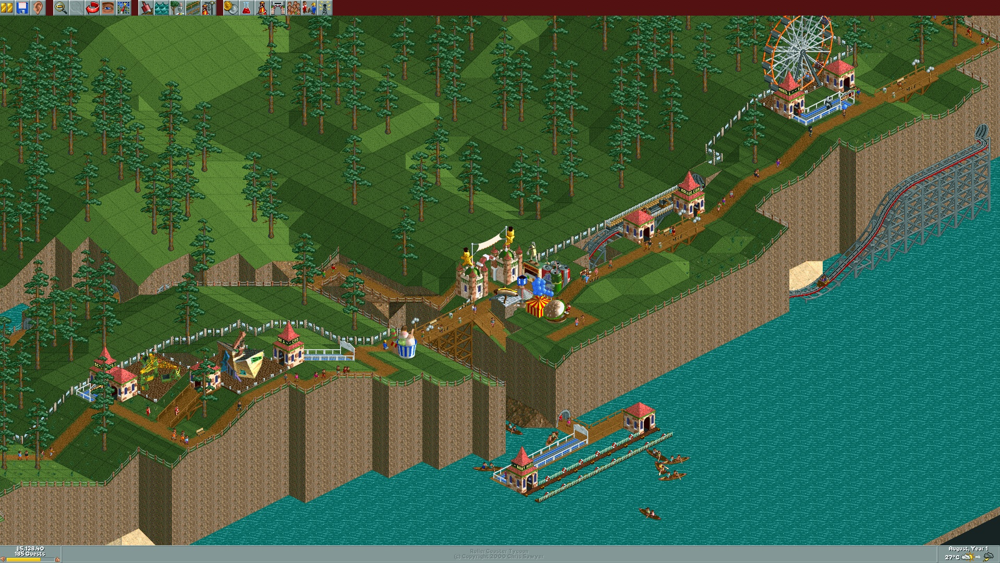

# RCT1 Deluxe Full HD

Malý kompatibilitní patch a launcher pro **původní RollerCoaster Tycoon 1 Deluxe** na moderních Windows.

Zachovává původní RCT1 engine a přidává:

- skutečnou herní plochu **1920×1080**
- borderless fullscreen
- kompatibilitu s Windows 11
- posouvání mapy myší u okrajů obrazovky
- podporu více monitorů
- automatické uvolnění kurzoru při Alt+Tab
- automatickou zálohu původního EXE

Nejde o roztažený obraz 1024×768. Upravené EXE skutečně dovolí hře vykreslit větší plochu, takže je z parku vidět více.

## Screenshoty

**RCT1 Deluxe běžící v rozlišení 1920×1080 na Windows 11**



Další ukázka ve Full HD:


## Otestovaná konfigurace

- Windows 11
- RollerCoaster Tycoon Deluxe ze Steamu, anglická verze
- Deluxe 1.20.015
- herní monitor 1920×1080
- dva monitory

## Důležité: před rozbalením ZIP odblokuj

Windows může staženému ZIPu přidat **Mark of the Web** a následně blokovat CMD/PowerShell skripty.

Ještě před rozbalením:

1. pravým tlačítkem na ZIP;
2. **Vlastnosti**;
3. zaškrtnout **Odblokovat**;
4. **Použít / OK**;
5. teprve potom rozbalit.

Pokud už je ZIP rozbalený, spusť v jeho složce PowerShell a použij:

```powershell
Get-ChildItem -File | Unblock-File
```

## Instalace

1. Nainstaluj **RollerCoaster Tycoon Deluxe**.
2. Obsah release ZIPu nakopíruj do hlavní složky hry, typicky:

   ```text
   C:\Program Files (x86)\Steam\steamapps\common\RollerCoaster Tycoon Deluxe\
   ```

3. Spusť:

   ```text
   Install-RCT-FullHD.cmd
   ```

4. Hru potom spouštěj přes:

   ```text
   Start-RCT-FullHD.cmd
   ```

Instalátor automaticky vytvoří zálohu původního EXE jako:

```text
RCT.original.exe
```

### Anglický Steam/GOG Deluxe 1.20.015

Anglické `RCT.EXE` bývá zabalené kompresorem **NeoLite**, takže se v něm potřebné hex hodnoty nedají upravit přímo.

Tento projekt záměrně **neobsahuje a nešíří žádné RCT.EXE**.

Pokud instalátor oznámí zabalené EXE, vytvoř ze své legálně nainstalované hry rozbalenou kopii, pojmenuj ji:

```text
RCT-unpacked.exe
```

dej ji vedle `RCT.EXE` a spusť instalátor znovu.

Podrobnosti jsou v [UNPACKING.md](UNPACKING.md).

## Co patch mění

U podporovaného rozbaleného anglického Deluxe 1.20.015 změní limit velikosti herního okna:

- 1280 → 1920 pixelů
- 1024 → 1080 pixelů

Současně nastaví kompatibilitu Windows pro `RCT.EXE`:

- Windows XP SP3
- 16bitové barvy
- DPI škálování provádí aplikace
- spouštění jako správce

## Proč borderless a ne původní fullscreen?

Původní DirectDraw fullscreen RCT1 vznikl pro rozlišení jako 640×480, 800×600 a 1024×768.

Widescreen patch funguje nejlépe tak, že RCT vykreslí větší **okenní** plochu a launcher z ní následně vytvoří borderless fullscreen.

RCT1 ale v okenním režimu nepoužívá posouvání mapy myší u okrajů. Launcher ho proto obnovuje:

1. při aktivní hře omezí kurzor na herní monitor;
2. rozpozná dotyk okraje;
3. emuluje odpovídající šipku;
4. při Alt+Tab kurzor i případně držené klávesy okamžitě uvolní.

Tím funguje edge-scrolling i na sestavě s více monitory.

## Více monitorů

Dokud je RCT aktivní, kurzor zůstává na herním monitoru, aby fungoval posun na všech čtyřech okrajích.

Pro přejetí myší na druhý monitor použij nejdřív **Alt+Tab**.

## Návrat k originálu

Spusť:

```text
Restore-Original-RCT.cmd
```

Vrátí se `RCT.original.exe` a odstraní se kompatibilitní nastavení zapsané instalátorem.

## Omezení

- První verze je otestovaná konkrétně na **1920×1080**.
- 2560×1440 a 4K zatím nejsou otestované/podporované.
- UI zůstává v původní pixelové velikosti, takže je ve Full HD menší.
- Launcher musí po dobu hraní běžet na pozadí, protože zajišťuje edge-scrolling a práci s více monitory.
- SmartScreen/antivirus může varovat před staženými CMD/PowerShell skripty; celý zdrojový kód je součástí balíku.

## Bez herních souborů

Projekt neobsahuje žádné EXE ani assety RollerCoaster Tycoon. Obsahuje pouze skripty, které upraví uživatelem dodané EXE z vlastní instalace.

## Licence

Skripty jsou pod licencí MIT. Herní soubory RollerCoaster Tycoon nejsou součástí projektu ani licence.

Jde o neoficiální komunitní projekt bez vazby na držitele práv ke hře.
