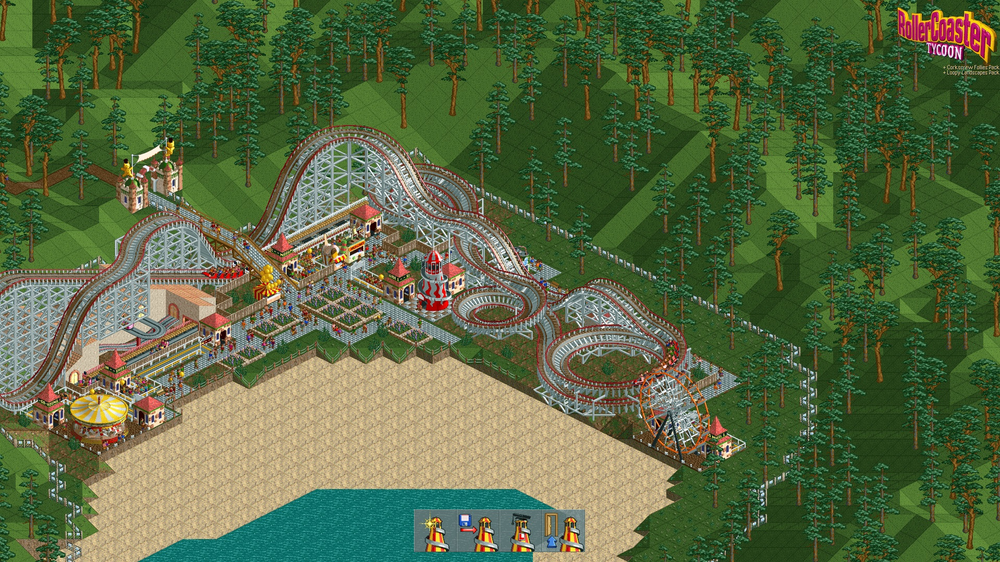

# RCT1 Deluxe Full HD

A small compatibility patch and launcher for the **original RollerCoaster Tycoon 1 Deluxe** on modern Windows.

It keeps the original RCT1 engine and adds:

- a genuine **1920×1080 game viewport**
- borderless fullscreen
- Windows 11 compatibility settings
- working mouse edge-scrolling
- multi-monitor support
- automatic cursor release on Alt+Tab
- automatic backup of the original executable
- **automatic unpacking of the common NeoLite-packed Steam/GOG executable**

The game is **not** rendered at 1024×768 and stretched. The patched executable can create a larger game surface, so you actually see more of the park.

## Screenshots

**RCT1 Deluxe running at 1920×1080 on Windows 11**


Another Full HD view:




## Tested configuration

- Windows 11
- RollerCoaster Tycoon Deluxe, English Steam edition
- Deluxe executable version 1.20.015
- 1920×1080 primary/game monitor
- dual-monitor setup

Other configurations may work, but the first release is intentionally focused on the setup above.

## Installation

1. Install **RollerCoaster Tycoon Deluxe** normally.
2. **Before extracting the downloaded ZIP**, right-click it → **Properties** → check **Unblock** → **Apply / OK**. This is important because Windows may otherwise block the CMD/PowerShell scripts.
3. Extract the ZIP.
4. From the downloaded package, copy these items into the game folder:

   - `Install-RCT-FullHD.cmd`
   - `Start-RCT-FullHD.cmd`
   - `Restore-Original-RCT.cmd`
   - the entire `patch` folder

   The README files can stay outside the game folder. This keeps the RCT directory tidy: only three small entry-point files and one `patch` folder are added.

   Typical Steam folder:

   ```text
   C:\Program Files (x86)\Steam\steamapps\common\RollerCoaster Tycoon Deluxe\
   ```

5. Double-click:

   ```text
   Install-RCT-FullHD.cmd
   ```

6. Approve the Windows UAC prompt.
7. Wait for the **Installation complete** message.
8. The installer also creates a Desktop shortcut named **RollerCoaster Tycoon FullHD** using the original game icon.
9. Start the game either from that Desktop shortcut or with:

   ```text
   Start-RCT-FullHD.cmd
   ```

That is all. **No Python installation and no command-line work is required.**

The installer automatically backs up the original executable as:

```text
RCT.original.exe
```

### English Steam/GOG 1.20.015 users

The common English Deluxe executable is compressed with **NeoLite**. The installer now handles this automatically.

If the Steam/GOG executable needs unpacking, the installer may temporarily download these **helper packages**:

- **Python 3.10.11 embeddable runtime** from python.org — portable Python used only to run the unpacker
- **Neo-Executable-Decompressor with ExeLock support**, pinned to commit `4c8e0166af65f4a5410cd6a011489e04ffee1bbd` — unpacks the RCT-specific ExeLock/NeoLite variant
- **pefile 2023.2.7** from GitHub — Portable Executable parsing used by the unpacker
- **zipfile-deflate64 0.2.0** from PyPI — Deflate64 decompression required by the ExeLock-packed RCT executable

These are downloaded only into the Windows temporary directory. The installer verifies the Deflate64 wheel against the SHA-256 published by PyPI, unpacks your own `RCT.EXE`, applies the Full HD patch, and then deletes the temporary helper files. Python is **not installed** into Windows.

An Internet connection is required during the first installation when automatic unpacking is needed.

See [UNPACKING.md](patch/UNPACKING.md) for technical details.

## What the installer changes

For the supported English Deluxe 1.20.015 unpacked executable, it changes the game's window-size clamp from:

- 1280 → 1920 pixels
- 1024 → 1080 pixels

It also configures Windows compatibility flags for `RCT.EXE`:

- Windows XP SP3 compatibility
- 16-bit colour mode
- application DPI scaling
- Run as administrator

## Why borderless instead of the game's fullscreen mode?

RCT1's original DirectDraw fullscreen modes were designed for resolutions such as 640×480, 800×600 and 1024×768.

The widescreen patch works best by allowing RCT to render a larger **windowed** surface, then turning that window into borderless fullscreen.

This creates one problem: original RCT1 disables mouse edge-scrolling in windowed mode.

The launcher restores it by:

1. confining the mouse pointer to the monitor containing RCT while the game has focus;
2. detecting when the pointer touches an edge;
3. emulating the corresponding arrow key;
4. immediately releasing the cursor and keys when you Alt+Tab away.

This also fixes the shared-edge problem on multi-monitor systems.

## Multi-monitor behaviour

While RCT has focus, the cursor stays on the game monitor so edge-scrolling works on all four sides.

To move the mouse to another monitor, use **Alt+Tab** first. The launcher immediately releases the cursor.

## Restoring the original game

Run:

```text
Restore-Original-RCT.cmd
```

This restores `RCT.original.exe` and removes the compatibility entry installed by this package.

## Limitations

- First release is specifically tested at **1920×1080**.
- Higher resolutions such as 2560×1440 and 4K are not yet supported/tested.
- UI elements stay at their original pixel size, so they look smaller at 1080p.
- The launcher must stay running in the background while RCT is running because it provides edge-scrolling and multi-monitor cursor confinement.
- Antivirus/SmartScreen may warn about CMD/PowerShell scripts downloaded from the Internet. The source is included so it can be audited.

## No game files included

This project contains **no RollerCoaster Tycoon game executable or assets**. It only contains scripts that patch a user-supplied executable from their own installation.

## Credits / prior research

This project builds on long-running community research into RCT1 widescreen/windowed rendering, especially:

- Widescreen Gaming Forum discussions documenting the English Deluxe 1.20.015 window-size byte patterns
- GOG community discussions around unpacked Deluxe executables and widescreen modes
- Russ Dill's open-source **Neo-Executable-Decompressor** project for NeoLite-packed executables

See [CREDITS.md](patch/CREDITS.md).

## License

The scripts in this repository are released under the MIT License. RollerCoaster Tycoon and its game files are not included and are not covered by this license.

This is an unofficial community project and is not affiliated with or endorsed by the game's rights holders.
